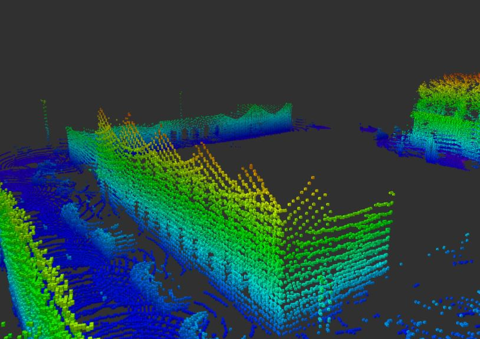

# Integration-of-the-sensory-system-for-an-autonomous-vehicle
Repository for building Octomap using Ouster Lidar sensor and IntelRealsense cameras

## Description
Model used for project is build out of sensors:
* Ouster OS0
* IntelRealsense D435 depth camera
* IntelRealsense T265 tracking camera
<p align="center">
  
</p>

Project is based on ROS noetic (Robot Operating System) and Ubuntu 20.04 platform. It is used to obtain octomap (using [octomap-mapping](https://github.com/OctoMap/octomap_mapping)) right after providing transformation beetween sensors. This step is discribed later in this readme file. This setup of cameras could be used i.e. on autonomous vehicle for self awareness of one's position in space, and the geometry of that space. Position of the system is tracked by T265 camera and ROS topic with odometry is provided to octomap_mapping. It's worth to mention here that it is not full SLAM developed and it's rely just on odometry from T265.

Map obtained using the system:
<p align="center">
  
</p>

## Getting Started

### Dependencies

* , needed before installing program.
* Ubuntu 20.04 with ROS noetic installed

### Installing

* How/where to download your program
* Any modifications needed to be made to files/folders

### Calibration

* describe how to 

### Modify otomap_mapping launch file

### Executing program

* How to run the program
* Step-by-step bullets
```
code blocks for commands
```

## Help

Any advise for common problems or issues.
```
command to run if program contains helper info
```

## Authors

* Joanna Walowska 
* [@tomaszkapron](https://github.com/tomaszkapron)

## License

This project is licensed under the [NAME HERE] License - see the LICENSE.md file for details

## Acknowledgments

Inspiration, code snippets, etc.
* [awesome-readme](https://github.com/matiassingers/awesome-readme)
* [PurpleBooth](https://gist.github.com/PurpleBooth/109311bb0361f32d87a2)
* [dbader](https://github.com/dbader/readme-template)
* [zenorocha](https://gist.github.com/zenorocha/4526327)
* [fvcproductions](https://gist.github.com/fvcproductions/1bfc2d4aecb01a834b46)
