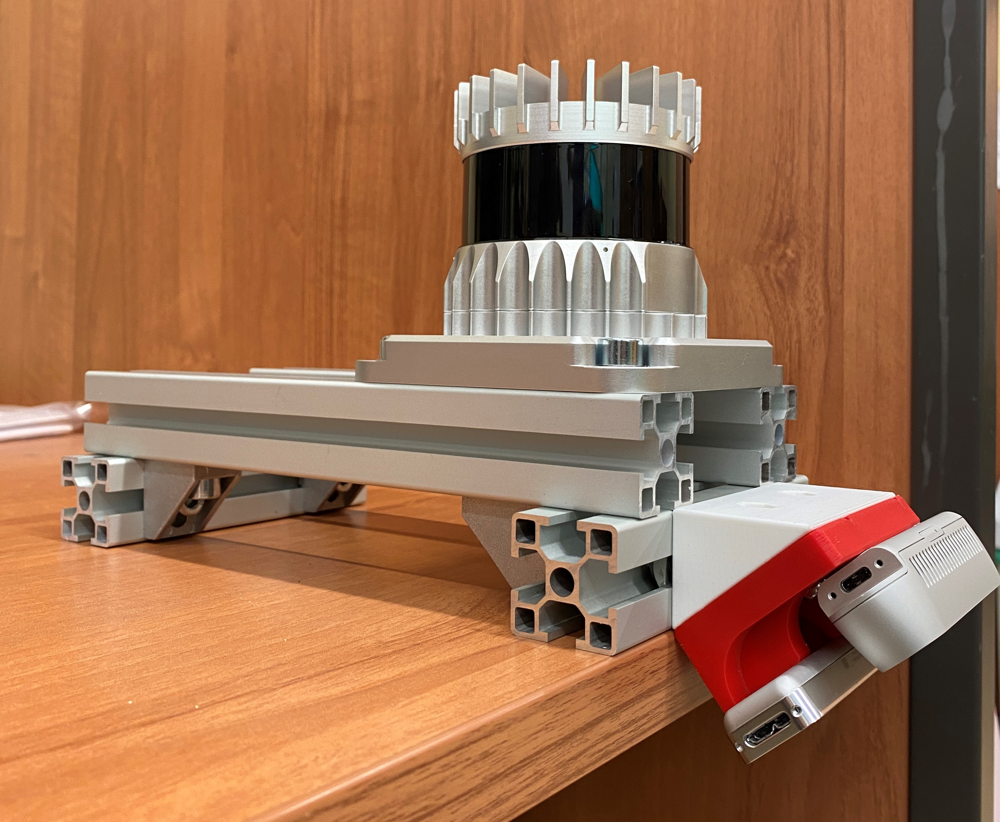
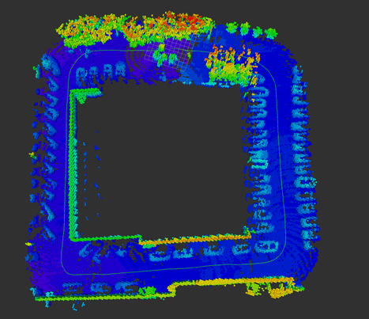

# Integration-of-the-sensory-system-for-an-autonomous-vehicle
Repository for building Octomap using Ouster Lidar sensor and IntelRealsense cameras

## Description
Model used for project is build out of sensors:
* Ouster OS0
* IntelRealsense D435 depth camera
* IntelRealsense T265 tracking camera
<p align="center">
  
</p>

Project is based on ROS noetic (Robot Operating System) and Ubuntu 20.04 platform. It is used to obtain octomap (using [octomap-mapping](https://github.com/OctoMap/octomap_mapping)) right after providing transformation beetween sensors. This step is discribed later in this readme file. This setup of cameras could be used i.e. on autonomous vehicle for self awareness of one's position in space, and the geometry of that space. Position of the system is tracked by T265 camera and ROS topic with odometry is provided to octomap_mapping. It's worth to mention here that it is not full SLAM developed and it's rely just on odometry from T265.

Map obtained using the system:
<p align="center">
  
</p>

## Getting Started

### Dependencies
* [realsense-ros](https://github.com/IntelRealSense/realsense-ros),
* [librerealsense](https://github.com/IntelRealSense/librealsense), 
* [octomap_mapping](https://github.com/OctoMap/octomap_mapping), 
* [ouster_example](https://github.com/ouster-lidar/ouster_example),
* [octomap](https://github.com/OctoMap/octomap),
* Ubuntu 20.04 with ROS noetic installed

### Installing
#### With catkin
```
cd catkin_ws/src
git clone https://github.com/tomaszkapron/Integration-of-the-sensory-system-for-an-autonomous-vehicle
cd ..
catkin_make
```

### Calibration
You need to provide translation beetween sensors according to T265 camera. Transation should be given in txt files, that can be found in scripts folder. Name of the files are t265_d435.txt and t265_lidar.txt accordingly to transformation to IntelRealsense D435 and Ouster Lidar sensor. Format of the text file is x, y, x, roll, pitch, azimut. Each parameter should be given in the new line. Parameters x, y, z are given in meters. Parameteres roll, pitch, azimut are given in degrees.
Those translation parameters can be obtained directly from CAD model or by using software such as ros kalibr node. Calibration for Lidar could be obtain i.e with [lidar_camera_calibration](https://github.com/heethesh/lidar_camera_calibration). The exact locations of the coordinate systems, inside the housings of the devices can be found in the documentation of the devices.


### Executing program

Navigate to scripts folder.
```
cd ~/catkin_ws/src/integr_sensors/scripts
```
Then simply run bash script runAllBash.sh
```
./runAllBash.sh
```
After 20s, all the sensors should be inicialized. All the topics should be available.

### Running octomap_mapping
To start building map via octomap_mapping navigate to catkin_ws folder and run roslaunch command.
```
roslaunch octomap_server octomap_mapping.launch
```

### Rviz
Map can be visualized in rviz. Fixed frame should be set to map.

## Authors
* [Joanna Walowska](https://github.com/panchasan)
* [Tomasz Kaproń](https://github.com/tomaszkapron)

## License

This project is licensed under the gnu general public license v3.0 License - see the LICENSE.md file for details

